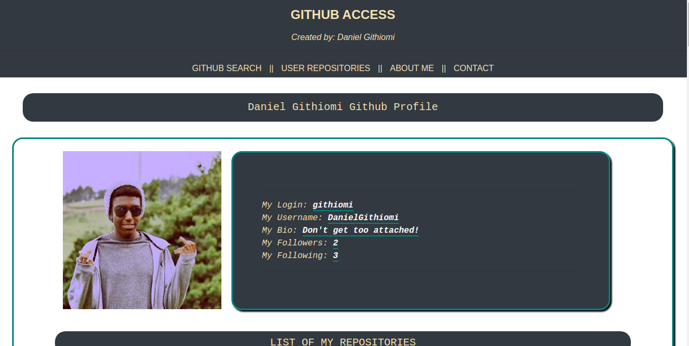

# GAccess

This project was generated with [Angular CLI](https://github.com/angular/angular-cli) version 9.0.7.
Created by; * Daniel Githiomi *

## Screenshots

  

## Description

Github Access (GAccess) is a website where users may enter a GitHub username into a form, submit it, and see names and descriptions of that person's public repositories. A person can also look for repositories

## Setup/Installation Requirements
* i5 Core
* 6GB RAM
* 1TB Internal storage 

## Compatibility

  Compatible with all browsers.
  further updates on the way. 

## Technologies Used
It is made completly using sublime Text 3 where all the following files were created and modified until the output is as you see it.
* HTML 5
* CSS, Bootstrap
* Javascript
* JQuery

## Known Bugs
No bugs to report at the moment! the system works efficiently at 100% guaranteed. Feel free to search the output on googl to ensure that it coincides exactly.

## Link to live page
[Click-Here](https://githiomi.github.io/GAccess)

## Setup Instructions
* git clone [This](https://githiomi.github.io/GAccess) into your terminal.  
* Open the folder in your favourite editor, for example vscode ,is code . and for atom, atom . 
* Open the index.html in your browser.
* Enjoy quotevine app

## Support and contact details
Contact me through any of the following:
* Slack: danielgithiomi
* Email: danielgithiomi@gmail.com

### License
Click the following to acces the license page: [Click-Here] (https://github.com/githiomi/license/blob/master/LICENSE)

Copyright (c) {2020} Dhosio Co.
